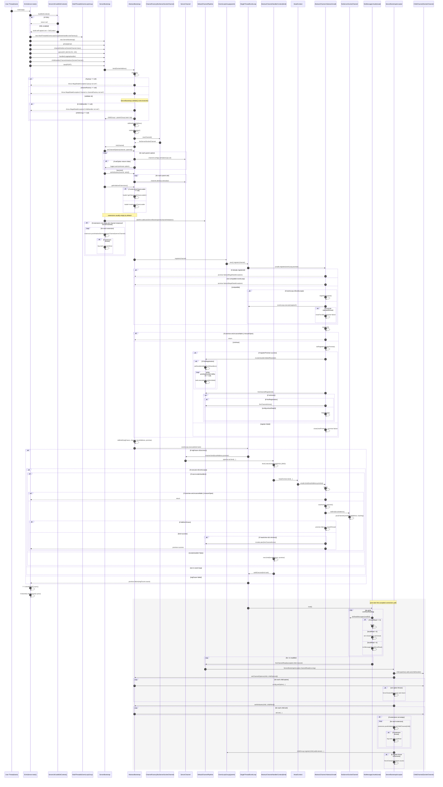

# EchoServer 启动时序图（方法级，含 if/else/for）

```mermaid
sequenceDiagram
    autonumber
    participant U as User Thread(main)
    participant ES as EchoServer.main()
    participant SU as ServerUtil.buildSslContext()
    participant ELG as MultiThreadIoEventLoopGroup
    participant SB as ServerBootstrap
    participant AB as AbstractBootstrap
    participant CF as ChannelFactory(NioServerSocketChannel)
    participant SC as ServerChannel
    participant PL as DefaultChannelPipeline
    participant PG as EventLoopGroup(parent)
    participant EL as SingleThreadEventLoop
    participant AHC as AbstractChannelHandlerContext(bind)
    participant HC as HeadContext
    participant AU as AbstractChannel.AbstractUnsafe
    participant NSSC as NioServerSocketChannel
    participant NIO as NioMessageUnsafe(read)
    participant SBA as ServerBootstrapAcceptor
    participant CH as ChildChannel(SocketChannel)

    U->>ES: main(args)
    ES->>SU: buildSslContext()
    alt if !SSL
        SU-->>ES: return null
    else SSL enabled
        SU-->>ES: build self-signed cert + SslContext
    end

    ES->>ELG: new MultiThreadIoEventLoopGroup(NioIoHandler.newFactory())
    ES->>SB: new ServerBootstrap()
    ES->>SB: group(group)
    ES->>SB: channel(NioServerSocketChannel.class)
    ES->>SB: option(SO_BACKLOG, 100)
    ES->>SB: handler(LoggingHandler)
    ES->>SB: childHandler(ChannelInitializer(SocketChannel))

    ES->>SB: bind(PORT)
    SB->>AB: bind(SocketAddress)

    AB->>AB: validate()
    alt if group == null
        AB-->>ES: throw IllegalStateException("group not set")
    else channelFactory == null
        AB-->>ES: throw IllegalStateException("channel or channelFactory not set")
    else validate ok
        Note over AB: ServerBootstrap.validate() extra branches
        alt if childHandler == null
            AB-->>ES: throw IllegalStateException("childHandler not set")
        else childGroup == null
            AB->>SB: childGroup = parentGroup (warn log)
        end
    end

    AB->>AB: doBind(localAddress)
    AB->>AB: initAndRegister()
    AB->>CF: newChannel()
    CF-->>AB: NioServerSocketChannel

    AB->>SB: init(channel)
    SB->>AB: setChannelOptions(channel, options[])
    loop for each parent option
        AB->>SC: channel.config().setOption(opt,val)
        alt if setOption returns false
            AB->>SB: logger.warn(unknown option)
        else success
        end
    end
    SB->>AB: setAttributes(channel, attrs[])
    loop for each parent attr
        AB->>SC: channel.attr(key).set(value)
    end

    SB->>AB: getInitializerExtensions()
    alt if extensionsClassLoader == null
        AB->>AB: loader=getClass().getClassLoader()
    else
        AB->>AB: loader=extensionsClassLoader
    end
    Note over AB,SB: extensions usually empty by default

    SB->>PL: pipeline.addLast(ServerBootstrapInit(ChannelInitializer))
    alt if extensions not empty && channel instanceof ServerChannel
        loop for each extension
            SB->>SB: extension.postInitializeServerListenerChannel(serverChannel)
            alt if extension throws
                SB->>SB: log warn and continue
            end
        end
    end

    AB->>PG: register(channel)
    PG->>EL: next().register(channel)
    EL->>AU: unsafe.register(eventLoop,promise)

    alt if already registered
        AU-->>AB: promise failure(IllegalStateException)
    else not compatible eventLoop
        AU-->>AB: promise failure(IllegalStateException)
    else compatible
        alt if eventLoop.inEventLoop()
            AU->>AU: register0(promise)
        else
            AU->>EL: eventLoop.execute(register0)
            alt if execute rejected/throws
                AU->>AU: closeForcibly + promise failure
            end
        end
    end

    AU->>AU: register0()
    alt if !promise.setUncancellable || !ensureOpen
        AU-->>AB: return
    else continue
        AU->>AU: doRegister(registerPromise)
        alt if registerPromise success
            AU->>PL: invokeHandlerAddedIfNeeded()
            alt if firstRegistration
                PL->>PL: callHandlerAddedForAllHandlers()
                loop while pendingHandlerCallback != null
                    PL->>PL: task.execute() (handlerAdded)
                end
            end
            AU->>PL: fireChannelRegistered()
            alt if isActive()
                alt if firstRegistration
                    AU->>PL: fireChannelActive()
                else config.isAutoRead()
                    AU->>AU: beginRead()
                end
            end
        else register failed
            AU->>AU: close(newPromise) + promise failure
        end
    end

    AB->>AB: doBind0(regFuture, channel, localAddress, promise)
    AB->>EL: eventLoop.execute(bind task)
    alt if regFuture.isSuccess()
        EL->>SC: channel.bind(localAddress,promise)
        SC->>AHC: pipeline.tail.bind(...)
        AHC->>AHC: findContextOutbound(MASK_BIND)
        alt if executor.inEventLoop()
            alt if next.invokeHandler()
                AHC->>HC: headContext.bind(...)
                HC->>AU: unsafe.bind(localAddress,promise)
                AU->>AU: bind()
                alt if !promise.setUncancellable || !ensureOpen
                    AU-->>ES: return
                else
                    AU->>AU: wasActive = isActive()
                    AU->>NSSC: doBind(localAddress)
                    NSSC->>NSSC: javaChannel().bind(localAddress, backlog)
                    alt if doBind throws
                        AU->>AU: promise failure + closeIfClosed
                    else bind success
                        alt if !wasActive && isActive()
                            AU->>PL: invokeLater(fireChannelActive)
                        end
                        AU-->>ES: promise success
                    end
                end
            else invokeHandler=false
                AHC->>AHC: next.bind(localAddress, promise)
            end
        else not in event loop
            AHC->>EL: safeExecute(bind task)
        end
    else regFuture failed
        EL-->>ES: promise failure(regFuture.cause)
    end

    ES->>ES: f = b.bind(PORT).sync()
    ES->>ES: f.channel().closeFuture().sync()

    rect rgb(245,245,245)
    Note over NIO,SBA: post-start first accepted connection path
    EL->>NIO: read()
    loop do-while continueReading
        NIO->>NSSC: doReadMessages(readBuf)
        alt if localRead == 0
            NIO->>NIO: break
        else localRead < 0
            NIO->>NIO: set closed=true and break
        else localRead > 0
            NIO->>NIO: incMessagesRead(localRead)
        end
    end
    loop for i in readBuf
        NIO->>PL: fireChannelRead(accepted child channel)
    end
    PL->>SBA: ServerBootstrapAcceptor.channelRead(ctx,msg)

    SBA->>CH: child.pipeline().addLast(childHandler)
    SBA->>AB: setChannelOptions(child, childOptions[])
    loop for each child option
        AB->>CH: config.setOption(...)
        alt set option throws
            SBA->>SBA: forceClose(child,cause) and return
        end
    end
    SBA->>AB: setAttributes(child, childAttrs[])
    loop for each child attr
        AB->>CH: attr.set(...)
    end

    alt if extensions not empty
        loop for each extension
            SBA->>SBA: extension.postInitializeServerChildChannel(child)
            alt if extension throws
                SBA->>SBA: log warn and continue
            end
        end
    end

    SBA->>PG: childGroup.register(child).addListener(...)
    alt if register future !isSuccess
        SBA->>SBA: forceClose(child,future.cause)
    end
    end
```

   
![[echoserver-startup-sequence.png]]